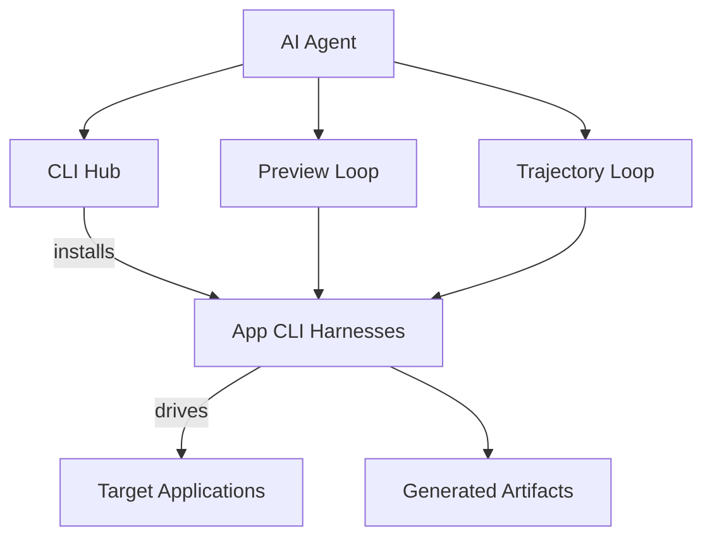

# Blueprint: savvops/CLI-Anything

_Auto-generated architectural documentation — 2026-09-24 (Phase 1). Built from the repository file tree, README and manifests._

## Diagram

## How it works

CLI-Anything (this repo is savvops' fork of the upstream HKUDS/CLI-Anything project) pursues a big idea: making all software agent-native. For each desktop application — CAD tools, 3MF utilities, QGIS, AdGuard Home, Audacity, and dozens more — the project builds a command-line harness that an AI agent can drive deterministically, instead of the agent fumbling with a GUI meant for humans.

The distribution mechanism is CLI-Hub (`https://hkuds.github.io/CLI-Anything/`): `pip install cli-anything-hub`, then `cli-hub install <name>` to browse, install, and manage community-built CLIs. Contributors add new harnesses via PR. Around the harnesses sit agent workflows demonstrated in the repo: preview loops, live preview, and trajectory loops where agents use the CLIs to produce real artifacts — 3D builds, diagrams, gameplay, subtitles. Each app directory in the repo is one harness: the bridge between an AI agent and that application's functionality.

## Key files

- Per-app directories (`3MF/`, `QGIS/`, `adguardhome/`, `audacity/`, …) — one CLI harness per application
- `assets/` — project branding and icons
- CLI-Hub packaging — the `cli-hub` installer experience
- `CONTRIBUTING.md` (upstream) — how to add a new CLI harness

## For the owner

This is a fork of an ambitious open-source project: giving AI agents a proper command line for every app, so they stop screen-scraping GUIs and start issuing clean commands. Your fork is a base to build on — and notably, JobRaven's job-application engine grew out of this same "drive software from the CLI" philosophy. Upstream (HKUDS/CLI-Anything) is where new harnesses and the hub evolve; keep the fork synced if you want those improvements.

_Corrected 2026-09-25: fixed `audacity/` directory name and the CLI-Hub URL._
